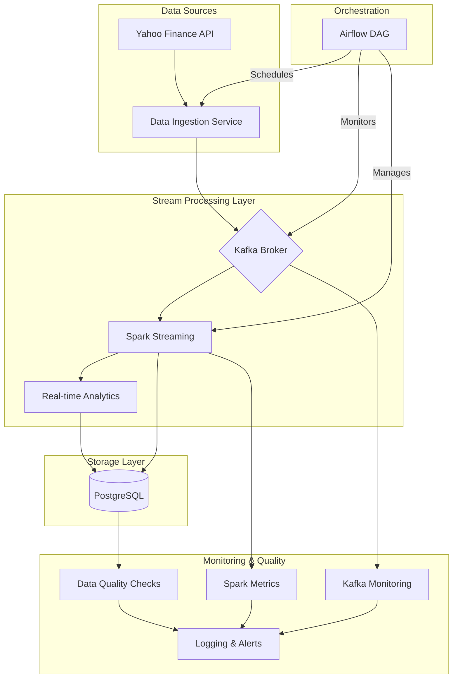

# Real-Time Financial Data Engineering Pipeline


A production-grade data engineering project that demonstrates real-time stock market data processing using modern data engineering practices and industry-standard tools.

## 📊 Service Architecture



## 📈 Real-Time Market Dashboard

Our Streamlit dashboard provides comprehensive market analytics and visualization:

### Dashboard Features
- **Real-Time Market Monitoring**
  - Live price tracking with candlestick charts
  - Volume analysis and trends
  - Price momentum indicators

- **Technical Analysis**
  - Moving averages (50, 200 day)
  - RSI and MACD indicators
  - Volume profile analysis

- **Data Quality Metrics**
  - Real-time data quality scoring
  - System health monitoring
  - Pipeline performance metrics

## 🚀 Key Components

### 1. Data Ingestion Layer
- Real-time stock data collection via Yahoo Finance API
- Data validation and cleaning
- Rate limiting and error handling
- Initial data quality checks

### 2. Stream Processing Layer
- Kafka-based real-time data streaming
- Spark Streaming for complex event processing
- Real-time technical analysis calculations
- Market pattern detection

### 3. Storage Layer
- PostgreSQL for structured data storage
- Efficient data partitioning
- Optimized query performance
- Historical data management

### 4. Orchestration Layer (Airflow)
- Automated workflow management
- Task dependency handling
- Error recovery mechanisms
- SLA monitoring

### 5. Visualization Layer (Streamlit)
- Interactive data exploration
- Real-time market analytics
- Custom technical indicators
- Performance monitoring

## 🛠️ Technology Stack

- **Data Collection:** Yahoo Finance API
- **Stream Processing:** Apache Kafka, Spark Streaming
- **Data Storage:** PostgreSQL
- **Orchestration:** Apache Airflow
- **Visualization:** Streamlit, Plotly
- **Quality & Monitoring:** Custom metrics, Prometheus
- **Language & Framework:** Python 3.8+

## 🚗 Quick Start Guide

1. Clone and setup environment:
```bash
git clone https://github.com/yourusername/financial-data-pipeline.git
cd financial-data-pipeline
python -m venv venv
venv\Scripts\activate  # Windows
```

2. Install dependencies:
```bash
pip install -r requirements.txt
```

3. Configure environment:
```bash
# Create .env file with:
POSTGRES_HOST=localhost
POSTGRES_PORT=5432
POSTGRES_DB=stockdb
POSTGRES_USER=postgres
POSTGRES_PASSWORD=your_password
```

4. Start services:
```bash
# Start Airflow
airflow webserver --port 8080
airflow scheduler

# Start Dashboard
streamlit run src/dashboard/app.py
```

## 🔄 Data Pipeline Flow

1. **Data Collection**
   - Scheduled market data fetching
   - Real-time price updates
   - Initial data validation

2. **Stream Processing**
   - Real-time data streaming through Kafka
   - Complex event processing
   - Technical analysis calculations

3. **Data Storage & Analysis**
   - Structured data storage in PostgreSQL
   - Historical data management
   - Performance optimization

4. **Visualization & Monitoring**
   - Real-time dashboard updates
   - Technical analysis display
   - System health monitoring

## 📊 Key Features

- **Real-Time Processing**
  - Sub-second data updates
  - Real-time analytics
  - Live monitoring

- **Scalable Architecture**
  - Distributed processing
  - Fault tolerance
  - High availability

- **Data Quality**
  - Automated validation
  - Quality scoring
  - Error handling

- **Market Analytics**
  - Technical indicators
  - Pattern recognition
  - Trend analysis

## 📝 License

This project is licensed under the MIT License - see the [LICENSE](LICENSE) file for details.

